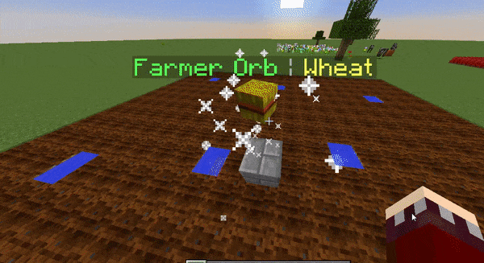

  

HandyOrbs
--------------
A Minecraft Spigot plugin that provide Orbs which do things around your server like planting crops, nether warts, help players at pvp and more. It is highly configurable if you are a server owner. Developers instead can integrate its core in their plugins without requiring to download it, more details bellow. This was initially developed as a plugin by qKing12, who decided to abandon it in October 2020 and gave me permission to use his ideas.  
Please note that I've fully re-coded it and I'm its copyright holder.  

WIP